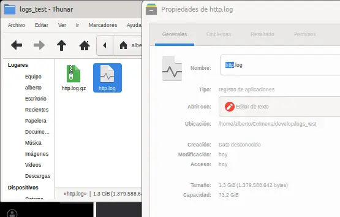
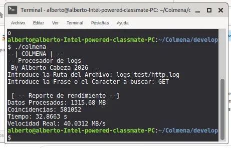

# **COLMENA** ⚡️🐝

## Ultra Fast Log Scalper 🚀 

### **COLMENA** es un Motor de búsqueda de patrones en archivos de texto plano diseñado para el rendimiento extremo.

#### Desarrollado en C++17, usa una arquitectura de lectura por bloques y gestión de estados para procesar archivos de GygaBytes en cuestión de segundos.

## Rendimiento Real

En pruebas realizadas sobre hardware estándar (_Intel-powered Classmate Laptop - Canaima Letras Rojas_), **COLMENA** alcanzó los siguentes resultados:

**Tamaño de archivo:** 1.3 GB (_http.log_)

**Tiempo Total:** 32s

**Velocidad real:** **40 MB/s**

**Coincidencias encontradas:** 581,052 (Patrón: "_GET_")

**Nota del Autor:** La velocidad de ~40MB/s es el límite físico del disco en el hardware de prueba. El código está optimizado para procesar datos tan rápido como el disco los entrega.

## Arquitectura Técnica 🏗

**Porqué es tan rápido?** ⚡ 

1. **Lectura por Bloques (64 KB):** No cargamos el archivo entero en la **RAM**, lo leemos por "baldes" para que el procesador siempre tenga trabajo.
2. **Rastreo Inteligente:** Si una palabra está cortada entre dos bloques, el programa igual la encuentra con su sistema de memoria de estado.
3. **Optimización O3:** El código está compilado para sacar el máximo provecho a los procesadores modernos.

## Cómo usarlo (Linux/Debian) 🚀 💻

1. **Compilar**: Escribe <pre>make</pre> en la terminal.
2. **Ejecutar**: Escribe
<pre>./colmena</pre>

3. **Probar**: Pon la ruta de tu _.log_, ej.<pre>logs*test/mi_log.log</pre>dale enter, luego te pedirá la **palabra**, **frase** o **caracter** que quieres que busque, escríbela y dale \_ENTER*.

## ¿No tienes un _.log_ para probar? 💾 📈

No te preocupes muchacho, aquí lo tienes, **comprimido**, solo pesa **50Mb**, ve a un wifi y descárgalo:

> **Antes que nada, aquí está el análisis de virus:**
> https://www.virustotal.com/gui/url/f300b5d47573adcc0d4a8da7c7e352323cb31f323355ff95baac1dcba393b5ed?nocache=1

---

1. **Descarga el dataset:** https://drive.google.com/file/d/1kezS0BVOLEwXEk2eD57elptKePDEUNBI/view?usp=drive_link

2. **Descomprime el archivo:** <pre>gunzip -k http.log.gz</pre>

Tardará un poco dependiendo de tu sistema. Muy poco... Y luego de eso tendras 1.3 Gb de datos para Procesar y Analizar.
