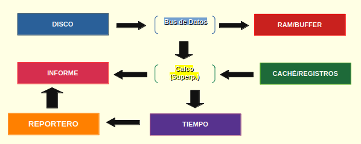

# Arquitectura de Colmena. :floppy_disk: :ledger:

## 1. Objetivo del sistema :chart_with_upwards_trend:

### Procesador de alto rendimiento diseñado para filtrar eventos críticos mediante acceso a memoria y comparación de patrones a nivel de bit.

### Diagrama de flujo de datos

**1. Capa de Almacenamiento.**

- **Origen**: Disco Duro(HDD) o SSD.
- **Forma**: El archivo está dividido en sectores físicos.\_
- **Acción**: El programa le pide al **Sistema** **Operativo** (_Kernel_) que abra el archivo.

**2. Capa de Transporte.**

- **Mecanismo**: El **Bus** **de** **datos** (SATA/NVMe).
- **Acción del Lector**: El módulo **Lector** pide un bloque de **64 KB**.

- **Hardware**: El **DMA** (Direct Memory Access) saca los bits del disco y los lleva a la **RAM** sin intervención de CPU.

**3. Buffer en RAM (Mesa de trabajo).**

- **Estado**: El dato ya está en la memoria volátil, pero el CPU aún no lo tienen a su disposición.

- **Acción**: El **Lector** le avisa al **Analizador**: Le entrega el puntero de donde están los datos que se van a manejar.

**4. Caché L1/L2 (Embudo de velocidad).**

- **Mecanismo**: El controlador de memoria del **CPU**.

- **Acción**: Como el **CPU** sabe que se va a leer el buffer, empieza a subir esos bits a la **Caché**, que está integrada en el **núcleo** del procesador.

- **Lógica**: Entonces la clase **Tiempo** empieza a cronometrar. Si el buffer es continuo, la caché se llena rápido (Cache Hit).

**5. Procesamiento en Registros (Calco de Bits).**

- **Mecanismo**: Registros de 64 bits y Unidades Aritmético-Lógicas (_ALU_).

- **Acción**: El **Analizador** toma 8 bytes (_64bits_) y los superpone contra un patrón de búsqueda (ej. "ERROR").

- **Resultado**: Si los voltajes coinciden (_operación XOR/AND_), se marca un acierto.

**La Salida (informe).**

- **Acción**: Si hubo coincidencia, se guarda la posición del bit en una lista de memoria.

- **Cierre**: Al terminar el archivo, el **Reportero** escribe todo en un archivo final y la clase **Tiempo** da el resultado de cuantos nanosegundos tardó cada paso.

<pre>
[DISCO] -> (Bus de Datos) -> [RAM/BUFFER]
                 |
                 v
[INFORME] <-   (Calco) <- [CACHÉ/REGISTROS]
                   |
                   v
[REPORTERO]  <- [TIEMPO]
</pre>

> Si no ves bien el texto preformateado, aquí tienes una imagen...

## 3. El papel del DMA (Direct Memory Acces)

EL **DMA** es como un coprocesador especializado en _mudanzas_. Su función es mover los bloques de datos desde el controlador de disco directamente a la **RAM**.

Sin el **DMA**, el **CPU** tendría que leer cada byte del disco, cargarlo en un registro y luego guardarlo en la RAM (_ese proceso se llama Programmed I/O_). Al usar el **DMA**, el **CPU** queda libre para ejecutar la lógica de la clase **Tiempo** y preparar el siguiente **Calco** mientras los datos aún están viajando.

# 4. ¿Porqué elegí un Buffer de 64 KB?

No uso **1GB** porque _saturaría_ la memoria, ni **1KB** porque el disco _perdería tiempo_ en arranques y paradas.

**A. Alineación con la Caché**

La mayoría de los procesadores modernos tienen una **Caché L1 de Datos** entre **32KB** y **64KB** por núcleo.

- Si el buffer es de **64KB**, cabe casi perfectamente en la memoria más rápida del procesador.

- Eso permite que el **Calco** trabaje a la máxima velocidad posible del silicio, evitando que el **CPU** tenga que salir a buscar datos en la **RAM**(_la mochila_) en mitad de una comparación. La **Caché** seria como el bolsillo (_Puede acceder más rápido_)

**B. El Ancho de banda del Bus**

Los discos modernos leen datos en bloques físicos (_sectores_). Pedir **64KB** es una medida justa para el **Bus de Datos**:

- Es lo suficientemente grande para que el **Bus NVMe/SATA** alcanze su velocidad máxima de transporte.

- Es lo suficientemente pequeño para que el **DMA** termine la transferencia antes de que el **CPU** termine de procesar el bloque anterior.

# 4. Capa de Transporte.

He seleccionado un tamaño de buffer de **64KB** para maximizar la afinidad con la **Caché L1** del procesador. Este tamaño permite que el **DMA** realice transferencias masivas de datos sin usar el **CPU**, garantizando que el hilo de ejecución siempre encuentre los datos listos para procesar en la memoria de alta velocidad. Esto reduce los **Cache Misses** y optimiza el uso del **Bus de Datos**, evitando los cuellos de botella durante la lectura de archivos de gran volumen.

# 5. Referencia Técnica.

_**Hennessy & Patterson (2017)**: Conceptos de Jerarquía de memoria y optimización de cahé aplicados al diseño del buffer de 64KB. - Arquitectura de computadores: Un Enfoque Cuantitativo_
